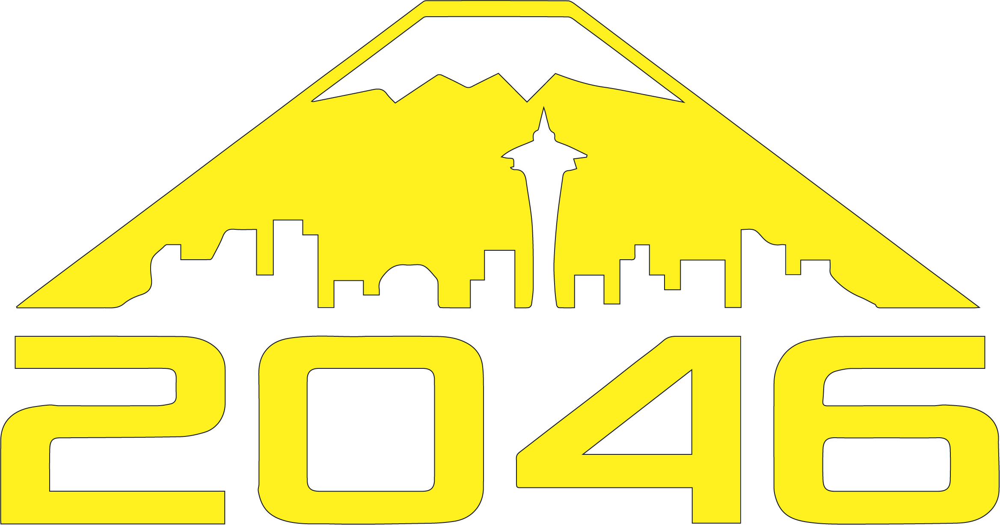

<h1>Bear Metal Docs</h1>

2046 knowledge base

---

-    
[:octicons-device-mobile-16: Apps](/apps){.md-button}

    ---

    Scouting and data viewing software

-    
[:octicons-briefcase-16: Business](/business){.md-button}

    ---

    Sponsorship, finance, and outreach

-    
[:octicons-device-desktop-16: Design](/design){.md-button}

    ---

    CAD, strategic design, and iteration

-    
[:octicons-gear-16: Fabrication](/fabrication){.md-button}

    ---

    Manufacturing fundamentals, tools, and shop practices

-   
[:octicons-zap-16: Hardware](/hardware){.md-button}

    ---

    Electronics, wiring, and assembly skills

-    
[:octicons-code-square-16: Programming](/programming){.md-button}

    ---

    Robot code, command-based architecture, and control theory

-    
[:octicons-circle-16: Drive Team](/drive-team){.md-button}

    ---

    Driver practice and match strategy

-    
[:octicons-heart-16: Impact & Outreach](/impact-and-outreach){.md-button}

    ---

    Spreading STEM in our community

-    
[:octicons-archive-16: Kitbot](/kitbot){.md-button}

    ---

    Kitbot program fundamentals and advice

-    
[:fontawesome-solid-users: Leadership](/leadership){.md-button}

    ---

    Building strong characters and cultures

-    
[:fontawesome-solid-screwdriver: Pits](/pits){.md-button}

    ---

    Pit skills and test prep

-    
[:fontawesome-solid-magnifying-glass: Scouting](/scouting){.md-button}

    ---

    Match data analysis and pick list strategy

